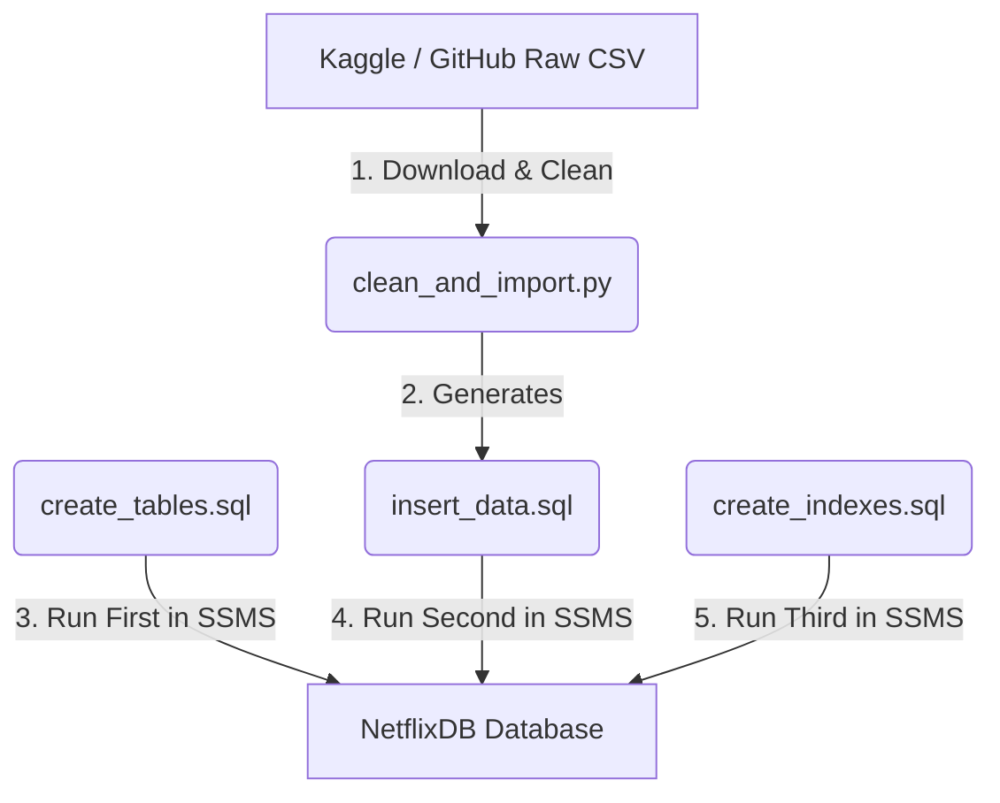
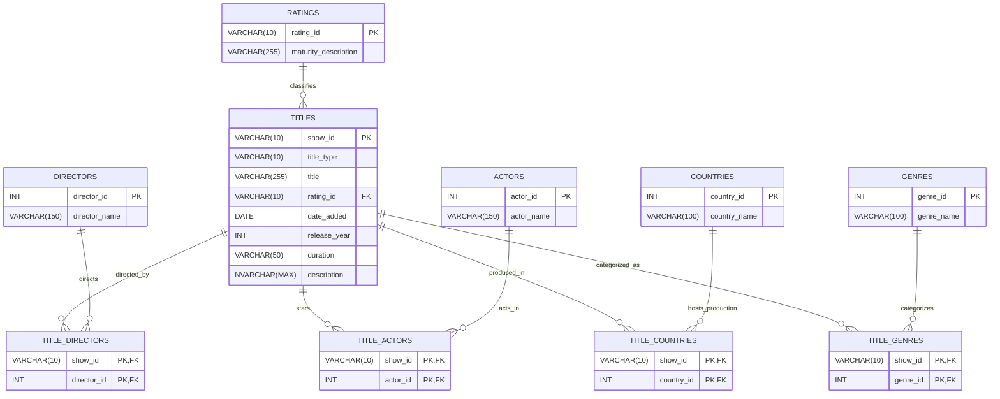

# Netflix Movies & TV Shows — Relational Database Project

**Documentation Set:** Import & Operations Playbook + Schema Design Mini-Project
**Database:** `NetflixDB` (SQL Server / SSMS)
**Source Dataset:** Netflix Movies and TV Shows (Kaggle, compiled by Shivam Bansal)

---

## 📑 Table of Contents

**Part I — Data Import & Operations Playbook**
1. [Pipeline Architecture](#1-pipeline-architecture)
2. [Step 1: Download & Clean (Python ETL)](#2-step-1-download--clean-python-etl)
3. [Step 2: Database Initialization (SSMS)](#3-step-2-database-initialization-ssms)
4. [Step 3: Schema Setup and Seeding (SSMS)](#4-step-3-schema-setup-and-seeding-ssms)
5. [Step 4: Verification](#5-step-4-verification)

**Part II — SQL DB Schema Mini-Project**
6. [Project Submission Details](#6-project-submission-details)
7. [Executive Summary & Business Context](#7-executive-summary--business-context)
8. [Entity-Relationship Diagram (ERD)](#8-entity-relationship-diagram-erd)
9. [Cardinality & Relationship Mapping Rules](#9-cardinality--relationship-mapping-rules)
10. [Data Dictionary & Modeling Deep-Dives](#10-data-dictionary--modeling-deep-dives)
11. [Normalization Theory (1NF, 2NF, 3NF)](#11-normalization-theory-1nf-2nf-3nf)
12. [Analytical Query Concept Guide](#12-analytical-query-concept-guide)
13. [Physical Relational Integrity Matrix](#13-physical-relational-integrity-matrix)
14. [Physical SQL Setup Scripts](#14-physical-sql-setup-scripts)
15. [Group Project Work Breakdown Structure (WBS)](#15-group-project-work-breakdown-structure-wbs)

---

# Part I — Data Import & Operations Playbook

This playbook documents the step-by-step pipeline for downloading the raw Netflix Movies & TV Shows dataset, cleaning and normalizing it using Python, and executing the deployment scripts in SQL Server Management Studio (SSMS).

## 1. Pipeline Architecture

The ETL (Extract, Transform, Load) and database setup pipeline relies on the following file sequence:



### File Manifest

| File | Purpose |
|---|---|
| **`clean_and_import.py`** | Python script that pulls the flat CSV dataset from Kaggle/GitHub, cleans single quotes, parses dates, splits comma-separated fields, and batches them into a single transactable SQL script. |
| **`create_tables.sql`** | Database creation DDL (Data Definition Language) script that creates the 10 normalized tables. |
| **`insert_data.sql`** | Seeding script populated with `INSERT` commands for all cleaned rows. |
| **`create_indexes.sql`** | Performance tuning script applying non-clustered indexes on search keys. |

> 📁 Project path: `.gemini/antigravity-ide/scratch/northwind-setup/`

---

## 2. Step 1: Download & Clean (Python ETL)

The Python script executes the cleaning rules to convert a flat, unnormalized spreadsheet into relational rows.

### A. Cleaning Rules Applied

| # | Rule | Description |
|---|---|---|
| 1 | **Single Quote Escaping** | Replaces `'` with `''` (e.g., safely escapes names with apostrophes to prevent SQL injection or compilation syntax errors). |
| 2 | **Date Parsing** | Converts verbose strings like `September 25, 2021` or `25-Sep-21` into standard SQL date format: `'2021-09-25'`. |
| 3 | **Atomicity Splits** | Splits comma-separated values in fields like `director`, `cast`, `country`, and `listed_in` (genres) into individual rows to satisfy **First Normal Form (1NF)**. |

### B. Execution

Run the script using your terminal or PowerShell console:

```powershell
# Navigate to project folder (Do not cd if running inside IDE Terminal)
python clean_and_import.py
```

**Expected output summary:**

```text
Downloading Netflix dataset...
Raw CSV saved to netflix_titles.csv
Reading and cleaning data...
Summary of extracted entities:
 - Titles: 7787
 - Ratings: 14
 - Directors: 4781
 - Actors: 32881
 - Countries: 122
 - Genres: 42
Writing SQL script to insert_data.sql...
Successfully generated SQL import script.
```

---

## 3. Step 2: Database Initialization (SSMS)

Configure the local SQL Server Express instance to host the new database.

1. Open **SQL Server Management Studio (SSMS)**.
2. Connect to your server:
   - **Server Name**: `localhost\SQLEXPRESS01` (or `.\SQLEXPRESS01`)
   - **Authentication**: Windows Authentication
3. Open a **New Query** window and run:

```sql
CREATE DATABASE NetflixDB;
GO
```

---

## 4. Step 3: Schema Setup and Seeding (SSMS)

To prevent referential integrity constraint errors, execute the SQL scripts in this **precise order**:

### Step 4.1 — Build Tables
Open **`create_tables.sql`** in SSMS, ensure the database dropdown context is set to **`NetflixDB`**, and execute (**F5**).

> *Why first?* Tables must exist with primary keys before child tables can define foreign keys referencing them.

### Step 4.2 — Populate Records
Open **`insert_data.sql`** in SSMS and execute (**F5**).

> *Note:* This file contains batch inserts for 7,787 titles and their associated actor/director mapping records — it may take **10–30 seconds** to complete. Transactions are wrapped in `BEGIN TRANSACTION` / `COMMIT TRANSACTION` to ensure database consistency.

### Step 4.3 — Apply Indexes
Open **`create_indexes.sql`** in SSMS and execute (**F5**).

> *Why last?* Creating indexes on empty tables is fast, but importing data on highly indexed tables slows insertions because the database must update B-Tree index pages for every row inserted. Running this last is database-loading best practice.

---

## 5. Step 4: Verification

To verify the data is fully populated, run this verification query in SSMS:

```sql
USE NetflixDB;
GO

SELECT 
    (SELECT COUNT(*) FROM dbo.TITLES) AS total_titles,
    (SELECT COUNT(*) FROM dbo.ACTORS) AS total_actors,
    (SELECT COUNT(*) FROM dbo.DIRECTORS) AS total_directors;
```

**✅ Expected Results:**

| Metric | Value |
|---|---:|
| `total_titles` | **7,787** |
| `total_actors` | **32,881** |
| `total_directors` | **4,781** |

---

# Part II — SQL DB Schema Mini-Project

## 6. Project Submission Details

| Field | Detail |
|---|---|
| **Course / Program** | Database Systems & Relational Modelling (Masterclass Series) |
| **Project Module** | SQL DB Schema Mini-Project |
| **Project Title** | Relational Database Normalization: Netflix Movies and TV Shows |
| **Group Identifier** | Group 4 (Data Architecture Team) |
| **Active Repository** | `northwind-setup` |
| **Parent Guideline Document** | `ERD_Masterclass_Guide.md` |

### 👥 Team Role Allocation & Contributions

| Member Name | Functional Role | Core Project Responsibilities |
|---|---|---|
| **User (You)** | **Lead Data Architect** | Defined entity boundaries, established primary/foreign key mappings, resolved multi-valued attributes, and drafted normalization rules. |
| **Antigravity (AI)** | **Database Administrator (DBA)** | Compiled the Mermaid.js Crow's Foot diagram, authored T-SQL DDL generation scripts (`create_tables.sql`), and designed indexing schemas (`create_indexes.sql`). |
| **Team Member 3 (Placeholder)** | **Business Analyst (BA)** | Mapped logical models to real-world user stories, drafted cardinality matrices, and compiled the final markdown deliverable. |
| **Team Member 4 (Placeholder)** | **QA & SQL Engineer** | Tested analytical query templates, verified referential integrity cascading delete parameters, and performed DDL dry runs. |

---

## 7. Executive Summary & Business Context

The **Netflix Movies and TV Shows dataset** (compiled by Shivam Bansal on Kaggle) lists 8,800+ movies and TV shows available on Netflix.

In its raw form, the dataset is a **flat CSV file** with columns containing **comma-separated lists** for `director`, `cast` (actors), `country`, and `listed_in` (genres). Storing lists inside single cells violates **First Normal Form (1NF)** because cells are not atomic. Searching for a specific actor or counting movies by genre requires slow `LIKE` string searches, which bypass indexes and degrade performance.

This design decomposes the comma-separated list values, normalizes the data into **10 tables**, and establishes a robust **3rd Normal Form (3NF)** relational database schema to support high-performance analytical queries.

---

## 8. Entity-Relationship Diagram (ERD)

Crow's Foot Notation showing relationships, key constraints, and cardinalities:



---

## 9. Cardinality & Relationship Mapping Rules

| Relationship | Mermaid Link | Parent Cardinality | Child Cardinality | Rationale (What / Why / How) |
|---|:---:|:---:|:---:|---|
| `RATINGS` → `TITLES` | `\|\|--o{` | Mandatory One | Optional Many | **What:** A rating classifies zero or many titles; a title belongs to exactly one rating. **Why:** Every show/movie must be classified. **How:** `TITLES.rating_id` FK references `RATINGS`. |
| `TITLES` → `TITLE_DIRECTORS` | `\|\|--o{` | Mandatory One | Optional Many | **What:** A title maps to zero or many junction rows. **Why:** A title can have multiple directors; some shows list none. **How:** Composite PK `(show_id, director_id)`. |
| `DIRECTORS` → `TITLE_DIRECTORS` | `\|\|--o{` | Mandatory One | Optional Many | **What:** A director maps to zero or many junction rows. **Why:** Directors work across multiple titles and persist even if shows are removed. **How:** FK `TITLE_DIRECTORS.director_id`. |
| `TITLES` → `TITLE_ACTORS` | `\|\|--o{` | Mandatory One | Optional Many | **What:** A title maps to zero or many cast rows. **Why:** Movies have multiple actors; documentaries may list none. **How:** Composite PK `(show_id, actor_id)`. |
| `ACTORS` → `TITLE_ACTORS` | `\|\|--o{` | Mandatory One | Optional Many | **What:** An actor maps to zero or many cast rows. **Why:** Actors star in multiple titles; records are permanent catalog elements. **How:** FK `TITLE_ACTORS.actor_id`. |
| `TITLES` → `TITLE_COUNTRIES` | `\|\|--o{` | Mandatory One | Optional Many | **What:** A title maps to zero or many production-country rows. **Why:** Movies can be co-produced across countries. **How:** Composite PK `(show_id, country_id)`. |
| `COUNTRIES` → `TITLE_COUNTRIES` | `\|\|--o{` | Mandatory One | Optional Many | **What:** A country maps to zero or many production rows. **Why:** Countries host multiple productions; static lookups. **How:** FK `TITLE_COUNTRIES.country_id`. |
| `TITLES` → `TITLE_GENRES` | `\|\|--o{` | Mandatory One | Optional Many | **What:** A title is tagged in zero or many genre rows. **Why:** Titles carry multiple genre tags. **How:** Composite PK `(show_id, genre_id)`. |
| `GENRES` → `TITLE_GENRES` | `\|\|--o{` | Mandatory One | Optional Many | **What:** A genre maps to zero or many classification rows. **Why:** Categories contain multiple shows and exist independently. **How:** FK `TITLE_GENRES.genre_id`. |

---

## 10. Data Dictionary & Modeling Deep-Dives

### A. Data Dictionary Tables

#### Table 1 — `TITLES`
*Core listing metadata for movies and TV shows.*

| Column | Type | Constraint | Nullable | Sample | Description |
|---|:---:|:---:|:---:|---|---|
| `show_id` | `VARCHAR(10)` | PK | No | `s1` | Unique show identifier |
| `title_type` | `VARCHAR(10)` | | No | `Movie` | Type of media (Movie or TV Show) |
| `title` | `VARCHAR(255)` | | No | `Dick Johnson Is Dead` | Title of listing |
| `rating_id` | `VARCHAR(10)` | FK | No | `PG-13` | References `RATINGS` |
| `date_added` | `DATE` | | Yes | `2021-09-25` | Date added to Netflix catalog |
| `release_year` | `INT` | | No | `2020` | Original release year |
| `duration` | `VARCHAR(50)` | | No | `90 min` | Mix of minutes (Movies) / seasons (TV) |
| `description` | `NVARCHAR(MAX)` | | No | `As her father nears the end...` | Brief description |

#### Table 2 — `RATINGS`
*Maturity ratings catalog.*

| Column | Type | Constraint | Nullable | Sample | Description |
|---|:---:|:---:|:---:|---|---|
| `rating_id` | `VARCHAR(10)` | PK | No | `PG-13` | Maturity code (e.g. PG-13, TV-MA) |
| `maturity_description` | `VARCHAR(255)` | | No | `Parents Strongly Cautioned` | Audience suitability description |

#### Table 3 — `DIRECTORS`
*Unique list of directors.*

| Column | Type | Constraint | Nullable | Sample | Description |
|---|:---:|:---:|:---:|---|---|
| `director_id` | `INT` | PK | No | `42` | Surrogate PK (auto-increment) |
| `director_name` | `VARCHAR(150)` | | No | `Kirsten Johnson` | Full name of director |

#### Table 4 — `TITLE_DIRECTORS`
*Junction table mapping titles to directors.*

| Column | Type | Constraint | Nullable | Sample | Description |
|---|:---:|:---:|:---:|---|---|
| `show_id` | `VARCHAR(10)` | PK, FK | No | `s1` | References `TITLES` |
| `director_id` | `INT` | PK, FK | No | `42` | References `DIRECTORS` |

#### Table 5 — `ACTORS`
*Unique list of cast members.*

| Column | Type | Constraint | Nullable | Sample | Description |
|---|:---:|:---:|:---:|---|---|
| `actor_id` | `INT` | PK | No | `156` | Surrogate PK (auto-increment) |
| `actor_name` | `VARCHAR(150)` | | No | `Tom Cruise` | Name of actor |

#### Table 6 — `TITLE_ACTORS`
*Junction table mapping titles to actors.*

| Column | Type | Constraint | Nullable | Sample | Description |
|---|:---:|:---:|:---:|---|---|
| `show_id` | `VARCHAR(10)` | PK, FK | No | `s1` | References `TITLES` |
| `actor_id` | `INT` | PK, FK | No | `156` | References `ACTORS` |

#### Table 7 — `COUNTRIES`
*Lookup directory of production countries.*

| Column | Type | Constraint | Nullable | Sample | Description |
|---|:---:|:---:|:---:|---|---|
| `country_id` | `INT` | PK | No | `1` | Surrogate PK (auto-increment) |
| `country_name` | `VARCHAR(100)` | | No | `United States` | Country name |

#### Table 8 — `TITLE_COUNTRIES`
*Junction table mapping titles to production countries.*

| Column | Type | Constraint | Nullable | Sample | Description |
|---|:---:|:---:|:---:|---|---|
| `show_id` | `VARCHAR(10)` | PK, FK | No | `s1` | References `TITLES` |
| `country_id` | `INT` | PK, FK | No | `1` | References `COUNTRIES` |

#### Table 9 — `GENRES`
*Catalog list of genres/categories.*

| Column | Type | Constraint | Nullable | Sample | Description |
|---|:---:|:---:|:---:|---|---|
| `genre_id` | `INT` | PK | No | `12` | Surrogate PK (auto-increment) |
| `genre_name` | `VARCHAR(100)` | | No | `Documentaries` | Name of genre |

#### Table 10 — `TITLE_GENRES`
*Junction table mapping titles to genres.*

| Column | Type | Constraint | Nullable | Sample | Description |
|---|:---:|:---:|:---:|---|---|
| `show_id` | `VARCHAR(10)` | PK, FK | No | `s1` | References `TITLES` |
| `genre_id` | `INT` | PK, FK | No | `12` | References `GENRES` |

---

### B. Relational Modeling Deep-Dives

**Concept 1 — Decomposing Comma-Separated Multi-Valued Attributes (1NF)**
- **What?** Decomposing lists of values (e.g. `cast = 'Tom Cruise, Cameron Diaz'`) into individual atomic rows within a dedicated mapping table.
- **Why?** Leaving lists inside cells violates 1NF. A query like *"find all action movies starring Tom Cruise"* would need `WHERE cast LIKE '%Tom Cruise%'`, which cannot use an index due to the leading wildcard — forcing a full table scan. Normalized, `WHERE actor_id = 156` executes an instant Index Seek.
- **How?** Extract the text string, register unique items in lookup tables (`ACTORS`), and record relationships in a mapping table (`TITLE_ACTORS`).

**Concept 2 — Surrogate Keys vs Natural Keys**
- **What?** A surrogate key is an artificial identifier (auto-incrementing integer, e.g. `actor_id = 156`). A natural key is an attribute intrinsic to the entity (e.g. `actor_name = 'Tom Cruise'`).
- **Why?** Joining on large string columns is inefficient — string comparisons are byte-by-byte, while integers match at fixed 4-byte width. Using surrogate keys also avoids transitive update anomalies if a name changes.
- **How?** Apply `INT IDENTITY(1,1)` in SQL Server for `DIRECTORS`, `ACTORS`, `COUNTRIES`, and `GENRES`.

**Concept 3 — Duration String Parsing (Handling Mixed Metrics)**
- **What?** Managing a column with mixed units (Movies in minutes, TV Shows in seasons).
- **Why?** A plain string (`'93 min'`, `'3 Seasons'`) blocks numerical operations like average runtime or filtering shows with 5+ seasons.
- **How?** The physical schema stores `duration` as a string for compatibility; a production pipeline would parse it into `duration_value` (INT) and `duration_unit` (VARCHAR(10)) to enable SARGable queries like `WHERE duration_value > 5 AND duration_unit = 'Seasons'`.

---

## 11. Normalization Theory (1NF, 2NF, 3NF)

### First Normal Form (1NF)
- **What?** Atomic columns, no repeating groups.
- **Why?** Storing list items in cells prevents indexing.
- **How (Netflix context)?** Comma-separated strings in `director`, `cast`, `country`, and `listed_in` are split out of the flat CSV into distinct bridge tables (`TITLE_DIRECTORS`, `TITLE_ACTORS`, `TITLE_COUNTRIES`, `TITLE_GENRES`).

### Second Normal Form (2NF)
- **What?** 1NF + all non-key columns depend entirely on the primary key (no partial dependencies).
- **Why?** If director awards were stored inside `TITLE_DIRECTORS`, deleting a show mapping would lose award history (delete anomaly).
- **How (Netflix context)?** `TITLE_DIRECTORS` has composite PK `(show_id, director_id)`. Director attributes (like `director_name`) live in the parent `DIRECTORS` table, dependent only on `director_id`.

### Third Normal Form (3NF)
- **What?** 2NF + no transitive dependencies (non-key columns depending on other non-key columns).
- **Why?** Deleting show listings shouldn't delete maturity rating descriptions from the registry.
- **How (Netflix context)?** Instead of storing both `rating_id` and `maturity_description` in `TITLES` (a transitive chain `show_id → rating_id → description`), descriptions are isolated in `RATINGS`, remaining intact even if all PG-13 shows are deleted.

---

## 12. Analytical Query Concept Guide

### Query 1 — Top 10 Most Prolific Actors on Netflix

```sql
SELECT 
    a.actor_name,
    COUNT(ta.show_id) AS total_appearances
FROM TITLE_ACTORS ta
INNER JOIN ACTORS a 
    ON ta.actor_id = a.actor_id
GROUP BY a.actor_name
ORDER BY total_appearances DESC
OFFSET 0 ROWS FETCH NEXT 10 ROWS ONLY;
```

- **What?** Identifies the top 10 actors appearing in the most Netflix titles.
- **Why?** (Set Aggregations) With cast normalized into a bridge table, we group by the actor's surrogate ID and count associated show IDs.
- **How?** Join `TITLE_ACTORS` → `ACTORS` on `actor_id`; group by actor name; count show IDs; sort descending; fetch top 10.

---

### Query 2 — Percentage of Movies vs TV Shows Produced by Country

```sql
SELECT 
    c.country_name,
    SUM(CASE WHEN t.title_type = 'Movie' THEN 1 ELSE 0 END) AS movie_count,
    SUM(CASE WHEN t.title_type = 'TV Show' THEN 1 ELSE 0 END) AS tv_show_count,
    COUNT(t.show_id) AS total_titles
FROM TITLE_COUNTRIES tc
INNER JOIN COUNTRIES c 
    ON tc.country_id = c.country_id
INNER JOIN TITLES t 
    ON tc.show_id = t.show_id
GROUP BY c.country_name
HAVING COUNT(t.show_id) >= 10
ORDER BY total_titles DESC;
```

- **What?** Shows the distribution of movies vs TV shows by country, limited to countries with ≥10 productions.
- **Why?** (Conditional Aggregation & Post-Grouping Filters) A `CASE` inside `SUM` counts types dynamically during aggregation; `HAVING` excludes low-volume countries.
- **How?** Join `TITLE_COUNTRIES` → `COUNTRIES` → `TITLES`; group by country; sum conditional counts; apply `HAVING`; sort descending.

---

### Query 3 — Directors Who Work Exclusively Within a Single Genre

```sql
SELECT 
    d.director_name,
    COUNT(DISTINCT tg.genre_id) AS unique_genres_directed,
    MAX(g.genre_name) AS primary_genre
FROM TITLE_DIRECTORS td
INNER JOIN DIRECTORS d 
    ON td.director_id = d.director_id
INNER JOIN TITLE_GENRES tg 
    ON td.show_id = tg.show_id
INNER JOIN GENRES g 
    ON tg.genre_id = g.genre_id
GROUP BY d.director_name
HAVING COUNT(DISTINCT tg.genre_id) = 1;
```

- **What?** Finds directors who have only directed titles in a single genre.
- **Why?** (Distinct Counts & Aggregated Selects) `COUNT(DISTINCT genre_id) = 1` inside `HAVING` isolates single-genre directors; `MAX(genre_name)` displays the genre without adding it to `GROUP BY`.
- **How?** Join `TITLE_DIRECTORS` → `DIRECTORS`, `TITLE_GENRES`, `GENRES`; group by director; count distinct genres; filter `HAVING = 1`.

---

### Query 4 — Listing Growth Trends over Release Years

```sql
SELECT 
    release_year,
    SUM(CASE WHEN title_type = 'Movie' THEN 1 ELSE 0 END) AS movies_released,
    SUM(CASE WHEN title_type = 'TV Show' THEN 1 ELSE 0 END) AS tv_shows_released
FROM TITLES
WHERE release_year >= 2010
GROUP BY release_year
ORDER BY release_year ASC;
```

- **What?** Tracks annual volume growth of movies and TV shows since 2010.
- **Why?** (Chronological Aggregation) Groups rows by `release_year` after filtering older releases.
- **How?** Filter `release_year >= 2010`; group by year; sum conditional counts; sort chronologically.

---

### Query 5 — Average Duration of Movies Grouped by Maturity Rating

```sql
SELECT 
    r.rating_id,
    AVG(CAST(REPLACE(t.duration, ' min', '') AS INT)) AS avg_duration_minutes
FROM TITLES t
INNER JOIN RATINGS r 
    ON t.rating_id = r.rating_id
WHERE t.title_type = 'Movie'
  AND t.duration LIKE '% min'
GROUP BY r.rating_id
ORDER BY avg_duration_minutes DESC;
```

- **What?** Calculates average runtime (minutes) of movies grouped by maturity rating.
- **Why?** (String Parsing & Numerical Casts) `duration` is stored as a string (`'90 min'`), so it's cleaned with `REPLACE` and cast to `INT` before averaging.
- **How?** Filter for movies with `duration LIKE '% min'`; join with `RATINGS`; strip `' min'` and cast; group by rating; compute average.

---

## 13. Physical Relational Integrity Matrix

| Parent | Child | FK Column | Delete Action | Update Action | Rationale (What / Why / How) |
|---|---|---|:---:|:---:|---|
| `RATINGS` | `TITLES` | `rating_id` | `SET NULL` | `CASCADE` | **What:** Set a title's rating to `NULL` if the rating is deleted. **Why:** Deleting a rating shouldn't delete movies; they just become unrated. **How:** `ON DELETE SET NULL`. |
| `TITLES` | `TITLE_DIRECTORS` | `show_id` | `CASCADE` | `CASCADE` | **What:** Auto-delete junction rows if the title is deleted. **Why:** Junction rows can't exist without a valid title. **How:** Cascade deletes. |
| `DIRECTORS` | `TITLE_DIRECTORS` | `director_id` | `NO ACTION` | `CASCADE` | **What:** Block deleting a director if referenced by active shows. **Why:** Prevents orphaned credit lines. **How:** Restrict deletes. |
| `TITLES` | `TITLE_ACTORS` | `show_id` | `CASCADE` | `CASCADE` | **What:** Auto-delete cast rows if the title is deleted. **Why:** Cast mappings are direct children of the title. **How:** Cascade deletes. |
| `ACTORS` | `TITLE_ACTORS` | `actor_id` | `NO ACTION` | `CASCADE` | **What:** Block deleting an actor if referenced by active shows. **Why:** Prevents empty cast lists in historical records. **How:** Restrict deletes. |
| `TITLES` | `TITLE_COUNTRIES` | `show_id` | `CASCADE` | `CASCADE` | **What:** Delete country mappings if the title is deleted. **Why:** Mappings depend on the title. **How:** Cascade deletes. |
| `COUNTRIES` | `TITLE_COUNTRIES` | `country_id` | `NO ACTION` | `CASCADE` | **What:** Block deleting a country if referenced by active shows. **Why:** Prevents invalid location references. **How:** Restrict deletes. |
| `TITLES` | `TITLE_GENRES` | `show_id` | `CASCADE` | `CASCADE` | **What:** Delete genre mappings if the title is deleted. **Why:** Genre classifications depend on the title. **How:** Cascade deletes. |
| `GENRES` | `TITLE_GENRES` | `genre_id` | `NO ACTION` | `CASCADE` | **What:** Block deleting a genre if referenced by active shows. **Why:** Prevents uncategorized titles. **How:** Restrict deletes. |

---

## 14. Physical SQL Setup Scripts

To deploy this database schema, run the following sequential scripts:

1. **`create_tables.sql`** — Builds all 10 physical tables, sets primary keys, defines constraints, and applies foreign key reference behaviors.
2. **`create_indexes.sql`** — Compiles clustered and non-clustered indices to speed up analytical searches, joins, and filters.

---

## 15. Group Project Work Breakdown Structure (WBS)

| Phase | Focus Area & Key Deliverables | Primary Owner(s) | Status |
|---|---|---|:---:|
| **1: Domain Mapping** | Flat file requirements analysis, list attributes mapping | Business Analyst (BA) | ✅ Complete |
| **2: Relational Modelling** | Decomposing comma-separated lists, mapping junction tables | Lead Architect | ✅ Complete |
| **3: Schema Normalization** | Auditing tables for 1NF/2NF/3NF compliance to eliminate anomalies | Lead Architect | ✅ Complete |
| **4: Physical DDL Scripting** | Writing SQL Server scripts (`create_tables.sql`) with explicit surrogate keys | Database Admin (DBA) | ✅ Complete |
| **5: Query Optimization** | Compiling non-clustered indexes (`create_indexes.sql`) matching analytical filters | DBA & SQL Engineer | ✅ Complete |
| **6: Quality Verification** | Validating DDL dry-runs, foreign key constraints, and query templates | QA & SQL Engineer | ✅ Complete |

### 🔍 Architectural Design Review Notes
- **Atomicity Enforcement:** Decomposing comma-separated lists into junction tables satisfies 1NF, enabling index seeks on casts, genres, and countries.
- **Surrogate Index Speed:** Using auto-incrementing integers (`INT IDENTITY`) instead of string joins improves query performance.

---

*End of document — combined from the Import & Operations Playbook and the SQL DB Schema Mini-Project.*
