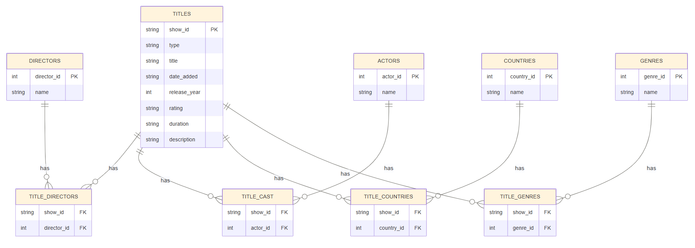
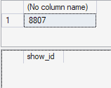
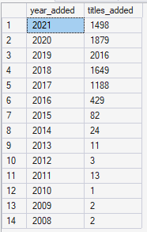
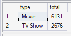
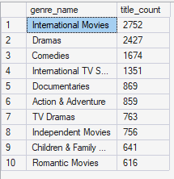
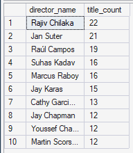
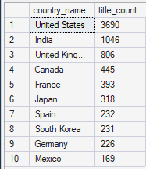

# Netflix Relational Database — SQL Mini-Project

A normalized SQL Server database built from the [Netflix Movies and TV Shows dataset](https://www.kaggle.com/datasets/shivamb/netflix-shows) on Kaggle. This project takes a single flat CSV and turns it into a properly structured relational database, then uses it to answer real analytical questions.

## Contents

- [The Dataset](#the-dataset)
- [Why Normalize It?](#why-normalize-it)
- [Schema Design](#schema-design)
- [Step 1: Creating the Tables](#step-1-creating-the-tables)
- [Step 2: Loading the Data](#step-2-loading-the-data)
- [Step 3: Validating the Data](#step-3-validating-the-data)
- [Step 4: Indexing](#step-4-indexing)
- [Step 5: Analysis Queries](#step-5-analysis-queries)
- [Step 6: Optimising a Query](#step-6-optimising-a-query)
- [Challenges Along the Way](#challenges-along-the-way)
- [What I'd Do Differently](#what-id-do-differently)

---

## The Dataset

`netflix_titles.csv` — one row per title (movie or TV show), including its director, cast, country, genre, release year, and date added to Netflix.


## Why Normalize It?

The raw CSV stores `director`, `cast`, `country`, and `genre` as comma-separated text in a single cell — for example, one row's `director` column might literally contain `"Robert Rodriguez, Alex Rivera"`.

That's a problem for a relational database: a column should hold one value, not a hidden list. So instead of one flat table, I split the data into:

- **One core table** (`Titles`) — one row per show
- **Four lookup tables** (`Directors`, `Actors`, `Countries`, `Genres`) — each real-world name stored exactly once
- **Four junction tables** — these connect titles to their directors/actors/countries/genres, since any title can have several of each

This is the standard fix for "one column, many values" — known as resolving a many-to-many relationship.

## Schema Design



## Step 1: Creating the Tables

**What:** Define every table, with primary keys (unique ID for each row) and foreign keys (links between tables).

**Why:** This is the actual database structure — it has to exist before anything else can happen.

**How:** One `CREATE TABLE` statement per table. Here's the core table as an example:

```sql
CREATE TABLE Titles (
    show_id       VARCHAR(10)   PRIMARY KEY,
    title         NVARCHAR(255) NOT NULL,
    type          VARCHAR(20)   NOT NULL,   -- 'Movie' or 'TV Show'
    date_added    DATE,
    release_year  SMALLINT      NOT NULL,
    rating        VARCHAR(10),
    duration      VARCHAR(20),
    description   NVARCHAR(1000)
);
```

Each lookup table (e.g. `Directors`) follows the same pattern — an ID column plus a name column. Each junction table (e.g. `TitleDirectors`) just holds two foreign keys, linking a show to a director.

## Step 2: Loading the Data

**What:** Get the CSV data into the database.

**Why it's not a simple one-step import:** the CSV's multi-value columns don't map directly onto a normalized schema — a single `director` cell might need to become one row in `Directors` and several rows in `TitleDirectors`. So loading happens in two stages:

**1. Staging table** — a temporary, flexible table that matches the raw CSV exactly (no keys, no strict types). The CSV loads here first, with zero risk of failing due to messy data.

```sql
CREATE TABLE Staging_Netflix (
    show_id       VARCHAR(10),
    director      NVARCHAR(MAX),   -- still comma-separated at this point
    country       NVARCHAR(MAX),
    listed_in     NVARCHAR(MAX),   -- genre
    -- ...remaining columns
);
```

The CSV is loaded into it using `BULK INSERT`:
```sql
BULK INSERT Staging_Netflix
FROM 'C:\NetflixData\netflix_titles.csv'
WITH (FIRSTROW = 2, FORMAT = 'CSV', FIELDTERMINATOR = ',', ROWTERMINATOR = '0x0a');
```

**2. Split and distribute** — SQL splits each comma-separated cell and inserts the individual values into the proper lookup and junction tables:
```sql
;WITH SplitDirectors AS (
    SELECT DISTINCT s.show_id, LTRIM(RTRIM(d.value)) AS director_name
    FROM Staging_Netflix s
    CROSS APPLY STRING_SPLIT(s.director, ',') d
    WHERE s.director IS NOT NULL
)
INSERT INTO Directors (director_name)
SELECT DISTINCT director_name FROM SplitDirectors sd
WHERE NOT EXISTS (SELECT 1 FROM Directors dr WHERE dr.director_name = sd.director_name);
```
The same pattern (split → insert distinct names → link to the show) repeats for actors, countries, and genres.

## Step 3: Validating the Data

**What:** Confirm the data actually loaded correctly — not just "it ran without an error."

**Why:** A query can complete successfully and still produce wrong results, e.g. if a join causes duplicate rows.

**How:** Two kinds of checks:
```sql
-- Row counts look sane
SELECT COUNT(*) FROM Titles;

-- No junction rows pointing to a show that doesn't exist
SELECT td.show_id FROM TitleDirectors td
LEFT JOIN Titles t ON t.show_id = td.show_id
WHERE t.show_id IS NULL;   -- should return 0 rows
```

**Output:**





## Step 4: Indexing

**What:** Add indexes — a lookup shortcut SQL Server can use instead of scanning every row.

**Why:** Without one, filtering or sorting a large table means reading it top to bottom every time.

**Where they were added:** on foreign key columns used in joins, and on columns used to filter (`release_year`, `type`) or sort (`date_added`).

```sql
CREATE INDEX IX_TitleGenres_GenreId ON TitleGenres(genre_id); --IX is a naming convention for index
CREATE INDEX IX_Titles_ReleaseYear  ON Titles(release_year);
```

## Step 5: Analysis Queries

Seven queries answering real questions about the data — for example:

```sql
-- Titles added per year (trend)

SELECT YEAR(date_added) AS year_added, COUNT(*) AS titles_added
FROM Titles
WHERE date_added IS NOT NULL
GROUP BY YEAR(date_added)
ORDER BY year_added;

-- Movie vs TV Show split

SELECT type, COUNT(*) AS total
FROM Titles
GROUP BY type;

-- Top 10 genres

SELECT TOP 10 g.genre_name, COUNT(*) AS title_count
FROM TitleGenres tg
JOIN Genres g ON g.genre_id = tg.genre_id
GROUP BY g.genre_name
ORDER BY title_count DESC;

-- Top 10 directors

SELECT TOP 10 d.director_name, COUNT(*) AS title_count
FROM TitleDirectors td
JOIN Directors d ON d.director_id = td.director_id
GROUP BY d.director_name
ORDER BY title_count DESC;

-- Content distribution by country

SELECT TOP 10 c.country_name, COUNT(*) AS title_count
FROM TitleCountries tc
JOIN Countries c ON c.country_id = tc.country_id
GROUP BY c.country_name
ORDER BY title_count DESC;
```

**Output:**







## Step 6: Optimising a Query

**Target query** — filters by release year, sorted by date added:
```sql
SELECT title, release_year, date_added
FROM Titles
WHERE release_year > 2018
ORDER BY date_added;
```

**Before adding an index:** *[screenshot — execution plan + read count]*

**After** adding a matching index:
```sql
CREATE INDEX IX_Titles_ReleaseYear_DateAdded 
    ON Titles(release_year, date_added) 
    INCLUDE (title);
```
*[screenshot — execution plan + read count]*

**Result:** *[state plainly what happened — did SQL Server switch from scanning the whole table to seeking directly? If not, that's still a valid finding worth explaining: on a small table, the optimiser sometimes decides a scan is cheaper anyway.]*

## Challenges Along the Way

- **Generic `BULK INSERT` error** — the message didn't explain the real issue, which turned out to be a mismatch between the row terminator setting and the CSV's actual line endings. Fixed by using `0x0a` instead of `\n`.
- **Duplicate key error loading directors** — caused by a director's name being repeated within a single CSV cell. Fixed by deduplicating before inserting.
- **Validation query duplicated results** — joining three separate one-to-many relationships at once multiplied rows before they were counted. Fixed by aggregating each relationship separately instead.

## What I'd Do Differently

- *[e.g. split `duration` into a number + unit so it can be used numerically]*
- *[e.g. check how much date data was lost from failed conversions]*
- *[e.g. test the indexing improvement on a larger dataset, since this one may be too small to show a dramatic difference]*
